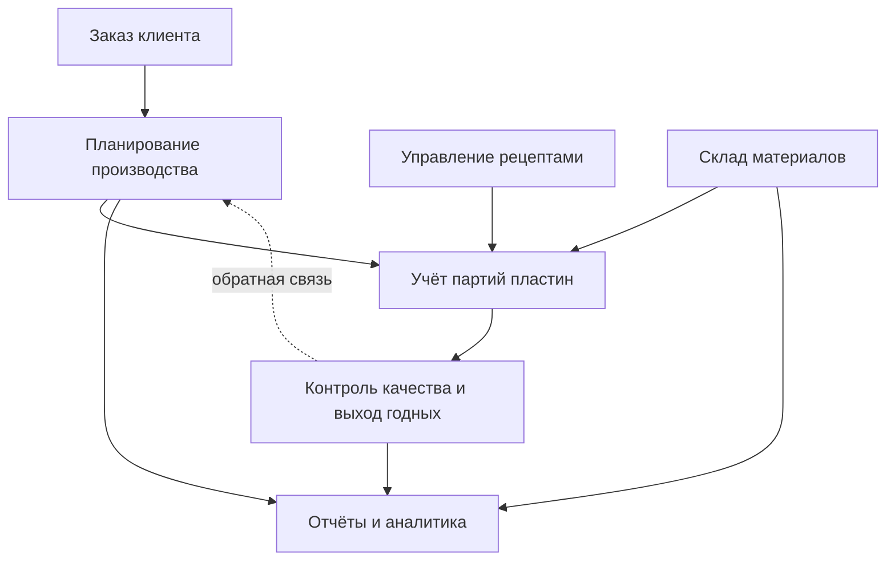

# architecture.md — архитектура системы КРИСТАЛЛ

Опирается на `research.md`, `problem.md`, `chip-process.md`.
Простым языком: из каких модулей состоит система и как они связаны.

---

## 1. Главные модули системы

### 1) Учёт партий пластин (Wafer-трекинг)
Сердце системы. Хранит «паспорт» каждой партии кремниевых пластин: где она сейчас,
на каком этапе производства, какой статус, сколько пластин. По сути это «история
жизни» каждой партии от резки слитка до готового чипа.

### 2) Планирование производства
«Мозг сверху» (часть ERP). Принимает заказы клиентов, превращает их в план: что,
сколько и к какому сроку нужно сделать. Следит за прогрессом выполнения и
распределяет работу по цеху.

### 3) Управление рецептами техпроцессов
Хранит «рецепты» — точные параметры каждого шага (температура, время, газы, доза
облучения). Выдаёт оборудованию правильный рецепт и не даёт запустить партию с
неверными параметрами. Это защита от брака.

### 4) Контроль качества и выход годных (Yield)
Собирает результаты тестов и считает **выход годных кристаллов** по каждой партии
— главную метрику завода. Показывает, где и на каком слое появляются дефекты,
чтобы инженеры могли быстро найти причину.

### 5) Склад материалов
Ведёт учёт расходных материалов: кремниевые пластины, фоторезист, технологические
газы, химия. Показывает остатки и предупреждает, когда чего-то осталось мало,
чтобы производство не встало.

### 6) Отчёты и аналитика
Собирает данные со всех модулей и показывает их руководству в виде понятных
дашбордов и отчётов: сколько заказов в работе, средний выход годных, загрузка
оборудования, расход материалов.

> (Дополнительно можно выделить модуль **Управление оборудованием** — следит за
> станками: занят/свободен/на обслуживании. В прототипе он показан через метрику
> «загрузка оборудования» на дашборде.)

---

## 2. Как модули связаны (поток данных)

Данные движутся по цепочке, как сам заказ на заводе:

**Заказ → План → Производство → Контроль → Отчёт**

1. Клиент делает **заказ** → он попадает в модуль **Планирование производства**.
2. План превращается в **партии пластин** → модуль **Учёт партий** заводит партию
   и ведёт её по этапам.
3. На каждом этапе модуль **Управление рецептами** выдаёт нужные параметры, а
   **Склад** списывает израсходованные материалы.
4. После тестов модуль **Контроль качества** считает **выход годных** и фиксирует
   дефекты.
5. Все данные стекаются в **Отчёты и аналитику** — и руководство видит полную
   картину. Если выход годных низкий, информация возвращается в планирование, и
   план корректируют.

Получается **замкнутый круг**: система не просто хранит данные, а помогает
улучшать производство.

---

## 3. Схема связей (mermaid)

Простыми словами: заказ задаёт план, план рождает партии пластин, рецепты и склад
обеспечивают их производство, контроль качества проверяет результат, а отчёты
показывают всю картину и подсказывают, что улучшить.

---

## Связь с прототипом

Эти модули напрямую отражены в разделах меню прототипа `index.html`:
**Дашборд** (Отчёты и аналитика), **Партии пластин** (Wafer-трекинг),
**План производства** (Планирование), **Контроль качества** (Yield),
**Склад** (Склад материалов).
